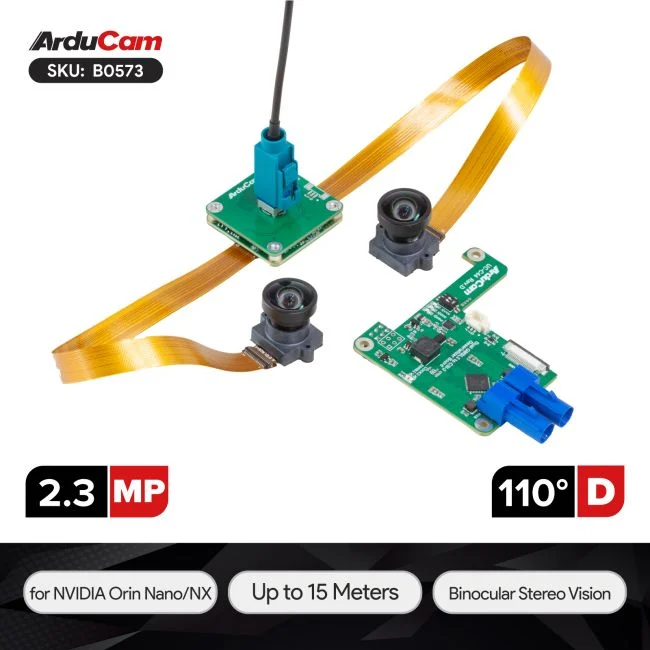
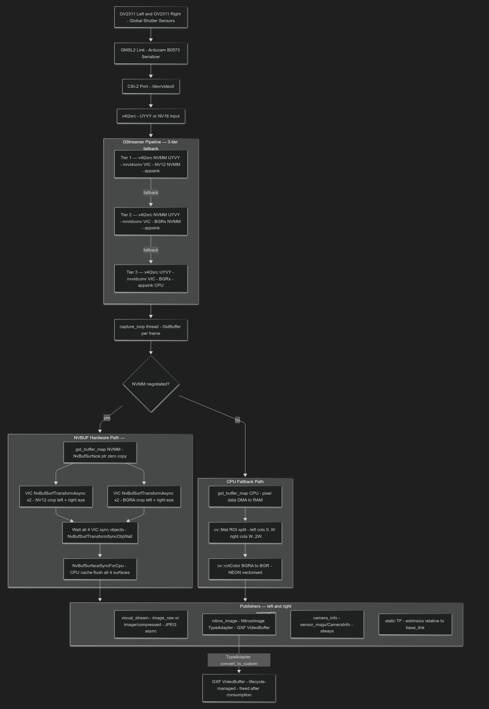

# arducam_dual_camera

A high-performance ROS 2 Humble composable node for the **Arducam B0573** — a 2.3 MP Global Shutter Dual-Camera kit (GMSL2-to-CSI2) — running on NVIDIA Jetson Orin Nano.

The node captures a hardware-synchronized side-by-side (SBS) stereo frame from the CSI-2 port, splits it into independent left and right streams, and publishes them over configurable topic channels per camera:

| Channel | Topic (default) | Message type | Notes |
|---|---|---|---|
| `visual_stream` | `…/image/compressed` | `sensor_msgs/CompressedImage` | JPEG, network-friendly (default) |
| `visual_stream` | `…/image_raw` | `sensor_msgs/Image` | raw BGR/RGB (set `transport: raw`) |
| `nitros_image` | `…/nitros_image_nv12` | `NitrosImage` | GPU-resident zero-copy, HAVE_NVBUF only |
| `camera_info` | `…/camera_info` | `sensor_msgs/CameraInfo` | calibration, always published |

---

</br>


> Note: Follow [this link](https://docs.arducam.com/GMSL-Camera-Solution/GMSL-Camera-for-NVIDIA/Quick-Start-Guide/) to set up the B0573 hardware and capture test video with `v4l2-ctl` before running the ROS node. The node expects the camera to be configured for side-by-side (SBS) output on `/dev/video0` by the time it starts.

</br>




## Hardware

```
[ OV2311 Left  ]──┐                        ┌─ /arducam/left/*
                   ├─ GMSL2 ─► B0573 ─► CSI-2 (Jetson)
[ OV2311 Right ]──┘            (SBS frame) └─ /arducam/right/*
```

| Property | Value |
|---|---|
| Sensor | OV2311 Global Shutter (1600×1200 native per eye) |
| Interface | GMSL2 → CSI-2 single cable, `/dev/video0` |
| Platform | NVIDIA Jetson Orin NX/Nano (JetPack 6.2+, DeepStream 7.1+) |
| Synchronization | Hardware-locked — both eyes share the same V4L2 buffer PTS |

---

## Build

```bash
# inside your ROS 2 workspace root
colcon build --packages-select arducam_dual_camera \
             --cmake-args -DCMAKE_BUILD_TYPE=Release
source install/setup.bash
```

Requires JetPack 6.2+, DeepStream 7.1+, Isaac ROS NITROS, and `libnvbufutils-dev`.  
When `libnvbufutils` is absent the node still builds and runs via the CPU fallback path.

---

## Launch

```bash
ros2 launch arducam_dual_camera dual_camera.launch.py
```

To override parameters at launch time:

```bash
ros2 launch arducam_dual_camera dual_camera.launch.py \
  width:=2560 height:=720 fps:=30
```

---

## Pipeline Architecture

### Data-flow overview




### GStreamer pipeline tiers

The node calls `try_build_pipeline()` up to three times, trying progressively simpler configurations until one succeeds.

| Tier | Memory | Format | VIC used | CPU copy |
|------|--------|--------|----------|----------|
| **1** | `NVMM` | NV12 | Yes — UYVY→NV12 + crop per eye | None — `NvBufSurface*` zero-copy |
| **2** | `NVMM` | BGRx | Yes — UYVY→BGRx + crop per eye | None — `NvBufSurface*` zero-copy |
| **3** | System RAM | BGRx | Yes — UYVY→BGRx via nvvidconv | Full frame DMA by V4L2 driver |

### NVBUF hardware path detail

When Tier 1 or 2 is active, each captured frame stays in NVMM device memory from the sensor to the publishers with minimal CPU involvement:

1. `gst_buffer_map(NVMM)` → `NvBufSurface*` pointer — O(1), no pixel copy.
2. Four `NvBufSurfTransformAsync` calls are submitted concurrently to the VIC:
   - NV12 crop → left eye surface (NITROS path)
   - NV12 crop → right eye surface (NITROS path)
   - BGRA crop → left eye surface (visual_stream path)
   - BGRA crop → right eye surface (visual_stream path)
3. All four VIC sync objects are waited. `gst_buffer_unmap`.
4. `NvBufSurfaceSyncForCpu` flushes CPU cache coherency on all four surfaces.
5. `make_nitros_image` stride-strips the NV12 surface into a preallocated `sensor_msgs::msg::Image` and publishes via TypeAdapter — the TypeAdapter creates a GXF VideoBuffer freed automatically after consumption.
6. JPEG visual_stream encoding is dispatched to `std::async` so the VIC is not stalled by the ~3–8 ms JPEG encode time.

### Bandwidth comparison at 2560×720 @ 30 fps

| Path | Data per frame | Bandwidth |
|------|---------------|-----------|
| NV12 NITROS TypeAdapter | 2.77 MB | ~83 MB/s |
| BGRx CPU full-frame copy | 7.37 MB | ~221 MB/s |

---

## Topics

All topics are published under the prefix configured by `topics.topic_name_prefix` (defaults `/arducam/left` and `/arducam/right`).

### Left camera

| Topic | Type | Published when |
|---|---|---|
| `/arducam/left/image_raw` | `sensor_msgs/Image` | `visual_stream.enable: true` and `transport: raw` |
| `/arducam/left/image/compressed` | `sensor_msgs/CompressedImage` | `visual_stream.enable: true` and `transport: compressed` |
| `/arducam/left/nitros_image_nv12` | `NitrosImage` | `nitros_image.enable: true` and `HAVE_NVBUF` compiled |
| `/arducam/left/camera_info` | `sensor_msgs/CameraInfo` | always |

### Right camera

| Topic | Type | Published when |
|---|---|---|
| `/arducam/right/image_raw` | `sensor_msgs/Image` | `visual_stream.enable: true` and `transport: raw` |
| `/arducam/right/image/compressed` | `sensor_msgs/CompressedImage` | `visual_stream.enable: true` and `transport: compressed` |
| `/arducam/right/nitros_image_nv12` | `NitrosImage` | `nitros_image.enable: true` and `HAVE_NVBUF` compiled |
| `/arducam/right/camera_info` | `sensor_msgs/CameraInfo` | always |

### TF

| Frame | Parent | Source |
|---|---|---|
| `left_camera` | `base_link` | `extrinsics.relative_to` + static TF broadcast |
| `right_camera` | `base_link` | `extrinsics.relative_to` + static TF broadcast |

---

## Parameters

All parameters live under the node name `arducam_dual_cam_node`. The `{side}` placeholder stands for either `left_camera` or `right_camera`.

### Global

| Parameter | Type | Default | Description |
|---|---|---|---|
| `device` | `string` | `/dev/video0` | V4L2 device node for the SBS camera |
| `width` | `int` | `2560` | Combined SBS frame width in pixels |
| `height` | `int` | `720` | Combined SBS frame height in pixels |
| `fps` | `int` | `30` | Requested capture frame rate |
| `pixel_format` | `string` | `UYVY` | V4L2 pixel format reported by `v4l2-ctl` — `UYVY` or `NV16` |

Available SBS resolutions for the B0573:

| `width` | `height` | Per-eye resolution |
|---|---|---|
| `3840` | `1200` | 1920 × 1200 |
| `2560` | `720` | 1280 × 720 |
| `1280` | `480` | 640 × 480 |

---

### Per-camera — identity

| Parameter | Type | Default | Description |
|---|---|---|---|
| `{side}.frame_id` | `string` | `left_camera` / `right_camera` | TF frame ID embedded in every published message header |
| `{side}.topics.topic_name_prefix` | `string` | `/arducam/left` / `/arducam/right` | Prefix for all topic names on this side |

---

### Per-camera — `visual_stream`

The visual stream publishes human-viewable images, either as raw pixels or JPEG-compressed.

| Parameter | Type | Default | Description |
|---|---|---|---|
| `{side}.topics.visual_stream.enable` | `bool` | `true` | Whether to publish the visual stream |
| `{side}.topics.visual_stream.transport` | `string` | `compressed` | `compressed` → `sensor_msgs/CompressedImage` JPEG &nbsp;·&nbsp; `raw` → `sensor_msgs/Image` |
| `{side}.topics.visual_stream.encoding` | `string` | `bgr8` | Pixel encoding: `bgr8` or `rgb8` |
| `{side}.topics.visual_stream.jpeg_quality` | `int` | `80` | JPEG quality 0–100 (only when `transport: compressed`) |
| `{side}.topics.visual_stream.qos.reliability` | `string` | `best_effort` | QoS reliability: `reliable` or `best_effort` |
| `{side}.topics.visual_stream.qos.durability` | `string` | `volatile` | QoS durability: `volatile` or `transient_local` |
| `{side}.topics.visual_stream.fps` | `int` | `30` | Target publish rate (actual rate limited by capture) |
| `{side}.topics.visual_stream.resolution.width` | `int` | `-1` | Output width in pixels — `-1` = same as capture |
| `{side}.topics.visual_stream.resolution.height` | `int` | `-1` | Output height in pixels — `-1` = same as capture |

---

### Per-camera — `nitros_image`

The NITROS stream delivers GPU-resident frames to downstream Isaac ROS nodes via zero-copy TypeAdapter without a full CPU round-trip.

| Parameter | Type | Default | Description |
|---|---|---|---|
| `{side}.topics.nitros_image.enable` | `bool` | `true` | Whether to publish NITROS frames (requires `HAVE_NVBUF`) |
| `{side}.topics.nitros_image.format` | `string` | `rgb8` | Pixel format: `rgb8` or `bgr8` — `nv12` is not recommended (TypeAdapter UV-plane limitation) |
| `{side}.topics.nitros_image.qos.reliability` | `string` | `reliable` | QoS reliability: `reliable` or `best_effort` |
| `{side}.topics.nitros_image.qos.durability` | `string` | `volatile` | QoS durability: `volatile` or `transient_local` |
| `{side}.topics.nitros_image.fps` | `int` | `30` | Target publish rate |
| `{side}.topics.nitros_image.resolution.width` | `int` | `-1` | Output width — `-1` = same as capture |
| `{side}.topics.nitros_image.resolution.height` | `int` | `-1` | Output height — `-1` = same as capture |

> **Note on `format: nv12`:** The Isaac ROS NITROS TypeAdapter's `convert_to_custom()` issues a single `cudaMemcpy2D` sized for the Y plane only. The UV plane in the resulting GXF `VideoBuffer` is never populated, producing a green-tinted image downstream. Use `rgb8` or `bgr8` instead.

---

### Per-camera — `camera_info`

| Parameter | Type | Default | Description |
|---|---|---|---|
| `{side}.topics.camera_info.qos.reliability` | `string` | `reliable` | QoS reliability |
| `{side}.topics.camera_info.qos.durability` | `string` | `volatile` | QoS durability |
| `{side}.topics.camera_info.fps` | `int` | `30` | Target publish rate |

---

### Per-camera — `extrinsics`

Rigid-body transform from `extrinsics.relative_to` to the camera optical frame. Broadcast once as a static TF at startup.

| Parameter | Type | Default | Description |
|---|---|---|---|
| `{side}.extrinsics.relative_to` | `string` | `base_link` | Parent TF frame for the static transform |
| `{side}.extrinsics.rotation` | `double[3]` | `[0, 0, 0]` | Roll, pitch, yaw in **degrees** |
| `{side}.extrinsics.translation` | `double[3]` | `[0, 0, 0]` | X, Y, Z offset in **metres** |

---

### Per-camera — `intrinsics`

Used to populate `sensor_msgs/CameraInfo` on every published frame.

| Parameter | Type | Default | Description |
|---|---|---|---|
| `{side}.intrinsics.fx` | `double` | `900.0` | Focal length x in pixels |
| `{side}.intrinsics.fy` | `double` | `900.0` | Focal length y in pixels |
| `{side}.intrinsics.cx` | `double` | `640.0` | Principal point x |
| `{side}.intrinsics.cy` | `double` | `360.0` | Principal point y |
| `{side}.intrinsics.distortion_model` | `string` | `plumb_bob` | `plumb_bob` · `rational_polynomial` · `thin_prism_fisheye` |
| `{side}.intrinsics.distortion_coefficients` | `double[5]` | `[0…]` | D vector for the chosen distortion model |
| `{side}.intrinsics.reflection_matrix.data` | `double[9]` | `I₃` | Rectification matrix R — row-major 3×3 |
| `{side}.intrinsics.projection_matrix.data` | `double[12]` | `[P·I\|0]` | Projection matrix P — row-major 3×4 — Tx = -fx·baseline for the right camera |

> **Placeholder values** — replace `fx`, `fy`, `cx`, `cy`, and the distortion coefficients with the results of a proper stereo calibration run before deploying.

---
