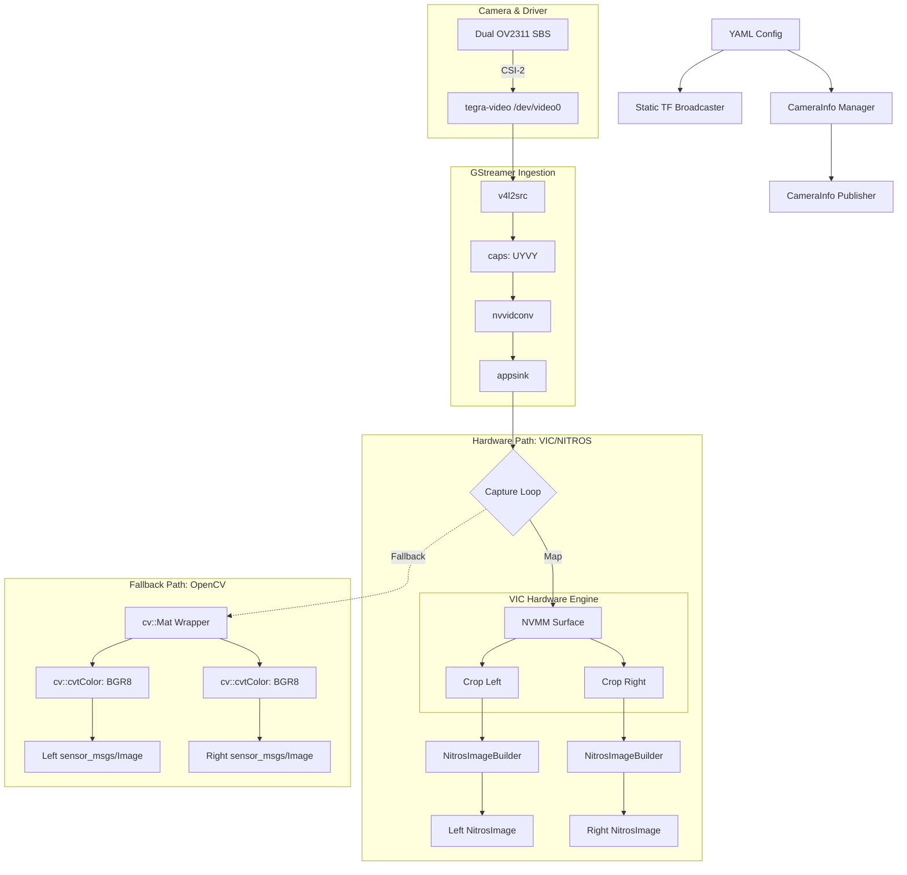

## arducam_dual_camera

A high-performance ROS 2 Humble package for the Arducam B0573 — a 2.3 MP Global Shutter Dual-Camera kit (GMSL2-to-CSI2) running on NVIDIA Jetson Orin Nano.

This node captures a side-by-side (SBS) stereo frame from the CSI-2 port, splits it into independent left and right image streams, and publishes them as standard sensor_msgs/Image or hardware-accelerated NitrosImage topics.

### Hardware Architecture

The B0573 uses two OV2311 global shutter sensors synchronized via a GMSL2 serializer/deserializer. The combined feed is delivered to the Jetson via a single CSI-2 interface.

```txt
[ Left Camera ]──┐
                  ├── GMSL2 link ──► Arducam B0573 GMSL2-to-CSI2 ──► CSI-2 Port (Jetson)
[ Right Camera ]─┘
```

**Sensor:** OV2311 (Global Shutter, 1600×1200 native resolution per eye)

**Interface:** GMSL2 → CSI-2 (/dev/video0)

**Platform:** NVIDIA Jetson Orin Nano / Xavier (JetPack 6.2+ / DeepStream 7.1+)


### Technical Features🚀 Hardware Acceleration (VIC + NITROS)

The primary data path utilizes the NVIDIA VIC (Video Image Compositor) unit. This allows for:

- **Zero-CPU Splitting:** Cropping the SBS frame into two halves is performed by hardware DMA.

- **On-the-fly Format Conversion:** Converts raw UYVY to NV12 (YUV 4:2:0) without hitting the CPU.

- **NITROS Integration:** Publishes NitrosImage types, allowing GPU-resident data to be passed to subsequent Isaac ROS nodes (like Disparity or VSLAM) with zero-copy overhead.


### 🔄 Intelligent Fallback

If the DeepStream/VIC libraries are not available at compile time or fail at runtime, the node automatically switches to an OpenCV-based CPU path, ensuring compatibility across diverse environments.


###  Data Flow Diagram

The following diagram illustrates the internal processing pipeline of the arducam_dual_cam_node:




### Installation & Build

- **Prerequisites**

  - ROS 2 Humble
  - JetPack 6.2 (DeepStream 7.1) for hardware acceleration
  - isaac_ros_nitros (optional, for GPU zero-copy)
  
  
### Building
```bash
cd ~/ros2_ws
colcon build --packages-select arducam_dual_camera
```


>> Note: The build system automatically detects nvbufsurface.h. If found, it defines HAVE_NVBUF and enables the VIC path.

### Configuration 


TODO


### Topics Published

- `/left/image_raw`: (sensor_msgs/Image or NitrosImage)

- `/right/image_raw`: (sensor_msgs/Image or NitrosImage)

- `/left/camera_info`: (sensor_msgs/CameraInfo)

- `/right/camera_info`: (sensor_msgs/CameraInfo)

- `/tf_static`: Static transforms between left and right sensors.


### Performance Notes

> **VIC Path:** ~1-2% CPU usage on Orin Nano at 30 FPS.

> **CPU Path:** ~15-20% CPU usage due to cv::cvtColor and cv::resize operations.

> **Latency:** The global shutter sensor combined with VIC acceleration provides minimal motion blur and sub-millisecond processing latency.


</br></br>

---
>> Author: WM Nipun Dhananjaya
---