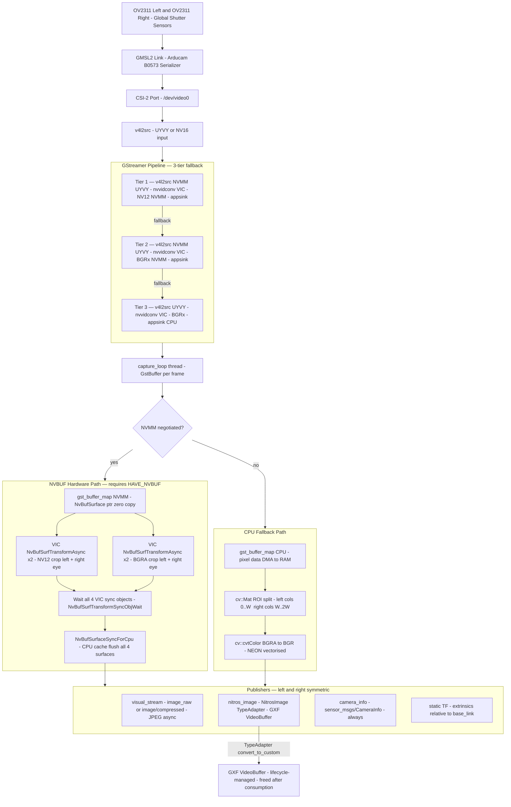

## Step-by-Step Pipeline Explanation

1. **Hardware Capture**: Frames are captured by the OV2311 left and right global shutter sensors. They travel via the GMSL2 serial link to the CSI-2 port where they surface as a `/dev/video0` video node.
2. **GStreamer Ingestion & Conversion**: GStreamer uses `v4l2src` to ingest frames. A 3-tier fallback checks system capabilities to find the most efficient processing format:
   * **Tier 1 (Optimal)**: Uses NVMM memory (hardware-accelerated) and NV12 format.
   * **Tier 2 (Sub-optimal HW)**: Uses NVMM memory but BGRx format.
   * **Tier 3 (CPU Fallback)**: Uses CPU memory and BGRx format.
3. **Capture Loop**: The GStreamer `appsink` feeds `GstBuffer` frames into a continuous C++ capture loop thread.
4. **Buffer Processing (Zero-copy NVMM path)**: If hardware buffers (NVMM) are negotiated successfully:
   * The pipeline gets a zero-copy pointer (`NvBufSurface`).
   * The hardware Video Image Compositor (VIC) asynchronously crops the combined image into left and right camera images in both NV12 and BGRA formats (4 distinct operations).
   * CPU waits for all VIC sync objects to finish, then syncs the CPU cache so the data can be read by downstream publishers.
5. **Buffer Processing (CPU fallback path)**: If hardware buffers failed:
   * Memory is mapped to system RAM.
   * OpenCV (`cv::Mat`) Regions of Interest (ROI) are used to split the combined stereo frame in half.
   * `cv::cvtColor` uses ARM NEON vector instructions to quickly convert BGRA to BGR.
6. **Publishing**: Processed frames are sent to symmetric left and right ROS publishers:
   * `visual_stream`: Standard ROS `sensor_msgs/Image` and compressed JPEG streams.
   * `nitros_image`: High-speed zero-copy `NitrosImage` messages.
   * `camera_info` and `tf`: Camera calibration parameters and spatial extrinsics.
7. **Isaac ROS Integration**: When publishing `nitros_image`, the ROS `TypeAdapter` converts the data into NVIDIA's `GXF VideoBuffer`. This hardware-managed buffer is lifecycle-managed and provides zero-copy transport for integration with down-stream hardware-accelerated Isaac ROS nodes.