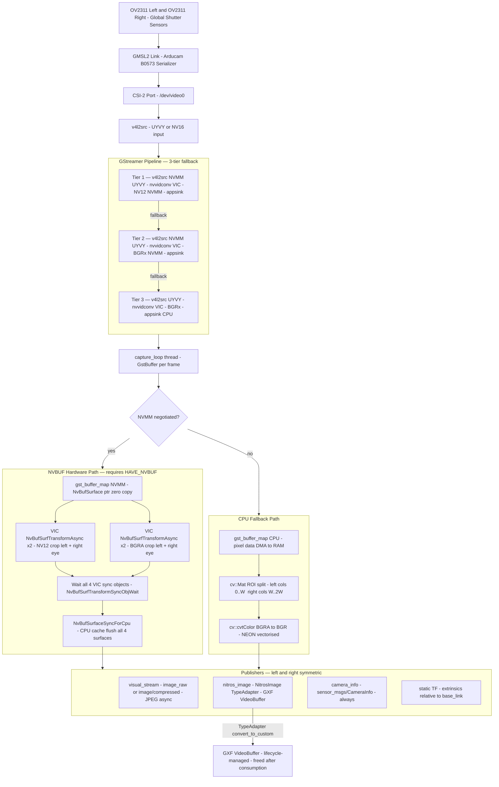

```mermaid
flowchart TD
    HW["OV2311 Left and OV2311 Right - Global Shutter Sensors"]
    GMSL["GMSL2 Link - Arducam B0573 Serializer"]
    CSI["CSI-2 Port - /dev/video0"]
    GST_SRC["v4l2src - UYVY or NV16 input"]

    subgraph GST["GStreamer Pipeline — 3-tier fallback"]
        direction TB
        P1["Tier 1 — v4l2src NVMM UYVY - nvvidconv VIC - NV12 NVMM - appsink"]
        P2["Tier 2 — v4l2src NVMM UYVY - nvvidconv VIC - BGRx NVMM - appsink"]
        P3["Tier 3 — v4l2src UYVY - nvvidconv VIC - BGRx - appsink CPU"]
        P1 -->|"fallback"| P2
        P2 -->|"fallback"| P3
    end

    HW --> GMSL --> CSI --> GST_SRC --> GST

    GST --> CB["capture_loop thread - GstBuffer per frame"]

    CB --> DEC{"NVMM negotiated?"}

    subgraph NVBUF_PATH["NVBUF Hardware Path — requires HAVE_NVBUF"]
        direction TB
        NVMAP["gst_buffer_map NVMM - NvBufSurface ptr zero copy"]
        VIC1["VIC NvBufSurfTransformAsync x2 - NV12 crop left + right eye"]
        VIC2["VIC NvBufSurfTransformAsync x2 - BGRA crop left + right eye"]
        SYNC["Wait all 4 VIC sync objects - NvBufSurfTransformSyncObjWait"]
        CPU_MAP["NvBufSurfaceSyncForCpu - CPU cache flush all 4 surfaces"]
        NVMAP --> VIC1
        NVMAP --> VIC2
        VIC1 --> SYNC
        VIC2 --> SYNC
        SYNC --> CPU_MAP
    end

    subgraph CPU_PATH["CPU Fallback Path"]
        direction TB
        GMAP["gst_buffer_map CPU - pixel data DMA to RAM"]
        SPLIT["cv::Mat ROI split - left cols 0..W  right cols W..2W"]
        CVTC["cv::cvtColor BGRA to BGR - NEON vectorised"]
        GMAP --> SPLIT --> CVTC
    end

    DEC -->|"yes"| NVBUF_PATH
    DEC -->|"no"| CPU_PATH

    subgraph PUB["Publishers — left and right symmetric"]
        direction LR
        VS["visual_stream - image_raw or image/compressed - JPEG async"]
        NIT["nitros_image - NitrosImage TypeAdapter - GXF VideoBuffer"]
        CI["camera_info - sensor_msgs/CameraInfo - always"]
        TF["static TF - extrinsics relative to base_link"]
    end

    CPU_MAP --> PUB
    CVTC --> PUB

    NIT -->|"TypeAdapter convert_to_custom"| GXF["GXF VideoBuffer - lifecycle-managed - freed after consumption"]
```